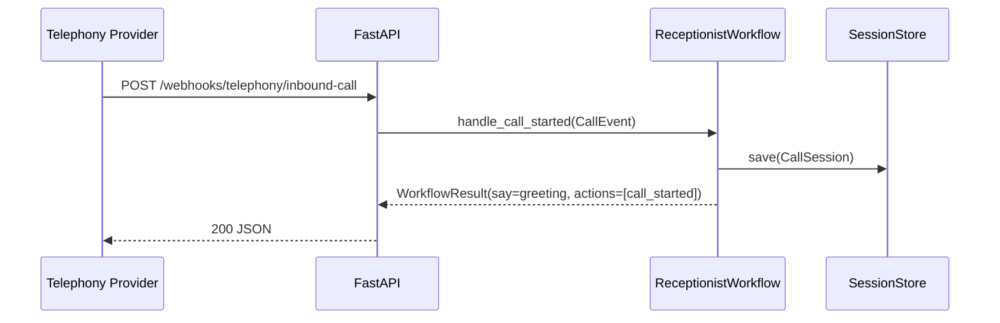
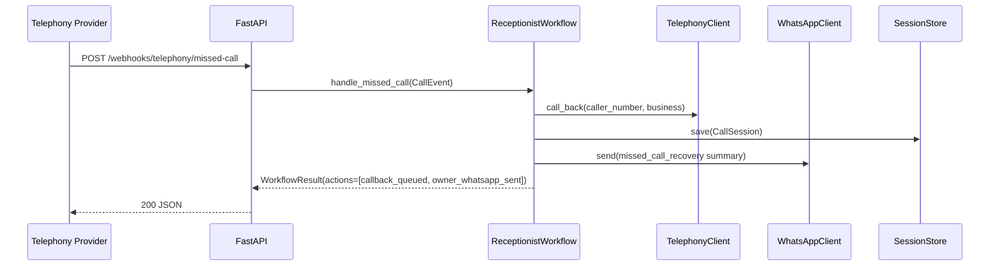
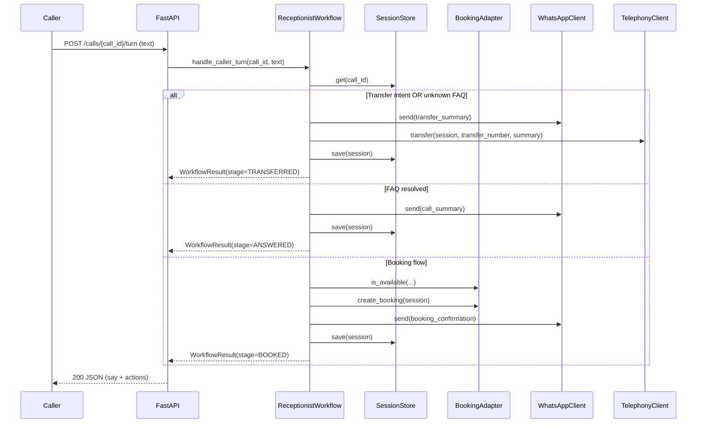

# API & Flow

## HTTP surface (upstream)

The MVP exposes:

- `GET /health` — health check
- `GET /` — built-in “Call Simulator” UI
- `POST /webhooks/telephony/inbound-call` — start an inbound call session
- `POST /webhooks/telephony/missed-call` — trigger missed-call recovery callback flow
- `POST /calls/{call_id}/turn` — submit a caller “turn” (utterance text) and receive workflow response
- `GET /debug/whatsapp-outbox` — inspect simulated WhatsApp outbox (demo mode)

## Sequence: inbound call start

## Sequence: missed-call recovery

## Sequence: caller turn (booking / FAQ / transfer)

## Notes on “AI”

In the MVP, intent detection and extraction are deterministic (keywords + regex) and produce bounded outputs that the workflow uses to decide the next step.

