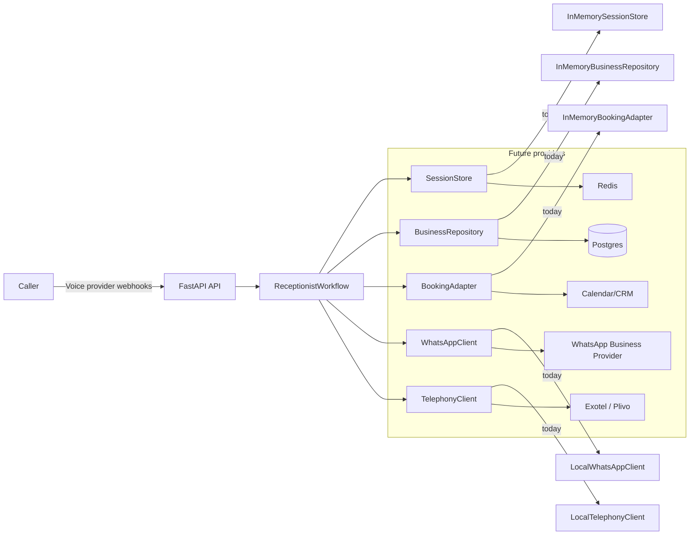

# Architecture

## High-level view

The MVP is built around a *ports-and-adapters* shape:

- HTTP (FastAPI) provides the webhook / simulator surface.
- A single orchestrator (`ReceptionistWorkflow`) owns call-state transitions and decisions.
- All integrations are behind ports (protocols) so real providers can be swapped in later.

## Module boundaries (upstream)

- `ai-voice-receptionist-mvp/app/core/models.py`
  - Domain models (`CallSession`, `BusinessProfile`, `WorkflowResult`, etc.)
- `ai-voice-receptionist-mvp/app/core/ports.py`
  - Integration contracts (Telephony, WhatsApp, Booking, repositories)
- `ai-voice-receptionist-mvp/app/adapters/memory.py`
  - In-memory/local implementations of the ports (simulation adapters)
- `ai-voice-receptionist-mvp/app/workflows/receptionist.py`
  - Deterministic orchestration of the five MVP workflows
- `ai-voice-receptionist-mvp/app/api/routes.py`
  - HTTP endpoints for webhooks + a built-in “call simulator” UI
- `ai-voice-receptionist-mvp/app/core/bootstrap.py`
  - Container wiring for demo mode (`build_demo_container`)

## Data flow and state

- **Ingress**: telephony webhooks hit FastAPI endpoints.
- **State**: `CallSession` is saved/retrieved through `SessionStore`.
- **Decisions**: intent classification + FAQ matching + booking slot/name extraction.
- **Egress**:
  - Telephony: callback / transfer via `TelephonyClient`.
  - WhatsApp: owner notifications via `WhatsAppClient`.
  - Booking: slot availability + booking creation via `BookingAdapter`.

## “AI agents” in this codebase

There are **no autonomous agents** in the MVP implementation. The system uses:

- rule-based **intent classification** (keywords)
- rule-based **FAQ key selection**
- regex-based **slot / name extraction**

This is deliberate to prove workflows and integration constraints first. When STT/TTS/LLM are added, they should remain behind ports and produce *bounded outputs* consumed by the workflow orchestrator.

