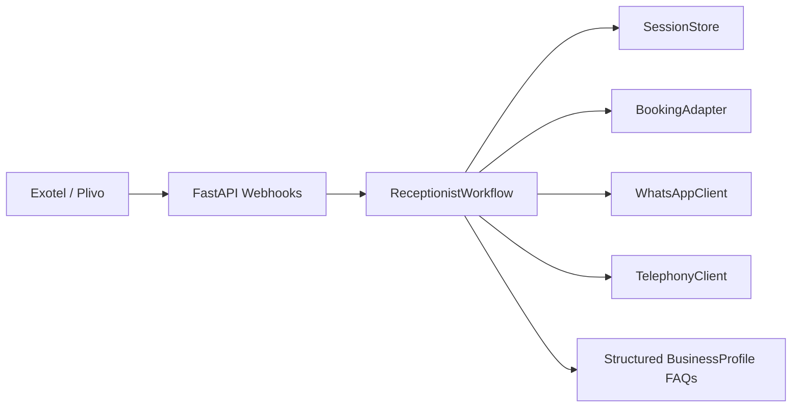

# Architecture Foundation

The MVP is a workflow orchestrator, not an autonomous-agent system.

## Boundaries

- `app/core/models.py`: domain objects and workflow result contracts
- `app/core/ports.py`: provider interfaces
- `app/workflows/receptionist.py`: deterministic orchestration for the five workflows
- `app/adapters/memory.py`: local test adapters
- `app/api/routes.py`: webhook and simulation HTTP surface

## Near-Term Implementation Order

1. Replace `LocalTelephonyClient` with Exotel or Plivo webhook and callback implementation.
2. Add Redis-backed `SessionStore`.
3. Add Postgres-backed business profiles, bookings, and call records.
4. Add WhatsApp Business provider adapter.
5. Add real-time audio WebSocket endpoint once telephony provider is chosen.
6. Add STT/TTS/LLM provider ports once live call streaming begins.

