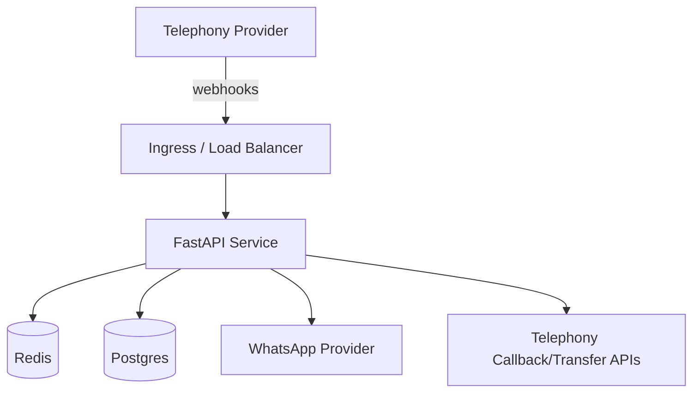

# Deployment

## MVP deployment goals

The MVP is designed to be deployable as a simple HTTP service that:

- receives telephony webhooks
- manages active call sessions
- triggers callbacks/transfers via a telephony provider
- sends WhatsApp owner notifications

## Suggested environments

- **Local**: Uvicorn with reload (developer workflow)
- **Staging**: single container / VM for integration testing with real providers
- **Prod (early)**: single-region container service + managed Redis/Postgres once ports are implemented

## Configuration (recommended)

The upstream code currently uses demo wiring (`build_demo_container`) and in-memory adapters. As providers are added, prefer environment variables for:

- telephony provider credentials + webhook verification secrets
- WhatsApp provider credentials
- Redis URL
- Postgres URL
- business onboarding / tenant configuration location (DB or config service)

## Deployment shape (future state)

## Operational concerns (when moving beyond MVP)

- **Idempotency** for webhooks and retries (provider-dependent)
- **Call session TTLs** and cleanup (Redis)
- **Audit logging** (call transcripts, summaries, booking refs)
- **PII handling** (phone numbers, names) + retention policies
- **Rate limiting** and abuse protection for public endpoints
- **Observability**: structured logs + request tracing

