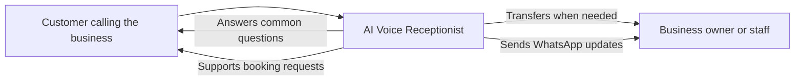

# Executive Summary

## What problem this application solves

Many small businesses lose revenue and customer trust when calls go unanswered, basic questions take too long to resolve, or staff are interrupted by repetitive phone work. This application appears to address that gap by acting as an always-available voice receptionist for common call scenarios.

Its practical goal is to help a business respond faster, recover missed calls, and make sure important call outcomes still reach the owner or staff.

## Who it is for

- Small and medium businesses that depend on phone calls for bookings or customer enquiries.
- Front-desk teams or owners who want fewer missed opportunities and less manual follow-up.
- Callers who need quick answers, a booking, or a transfer to a real person.

## What the application appears to do

Based on the repository, this is an MVP for an India-focused AI voice receptionist. It appears to answer incoming business calls, guide the caller through a small set of common tasks, and keep the business owner informed through WhatsApp updates.

The product direction looks intentionally narrow: instead of trying to handle every possible conversation, it focuses on a few high-value call outcomes that are easy for a business to understand and trust.

## Major business capabilities

1. **Missed call recovery**
   When a customer call is missed, the system appears to trigger a callback flow and notify the business owner so the opportunity is not lost.

2. **Booking support**
   The application appears to help callers request appointments or table bookings by collecting key details and confirming the result back to the business.

3. **Routine question handling**
   It appears to answer common business questions such as opening hours, location, pricing, services, parking, or menu-related information.

4. **Human handoff**
   If the caller wants a person, or the system cannot help clearly enough, it appears to transfer the interaction to staff rather than forcing the caller to stay with automation.

5. **Owner updates on WhatsApp**
   Important call outcomes appear to be summarized for the business owner through WhatsApp, creating a lightweight follow-up record without requiring them to review every call.

## Business view

## Assumptions and scope note

- **Assumption:** The intended early customers are businesses such as salons, clinics, and restaurants, because those examples appear repeatedly in the repository.
- **Assumption:** The current product is positioned as a focused MVP rather than a full customer-service platform, because the repository emphasizes a small set of core workflows over broader business operations.
