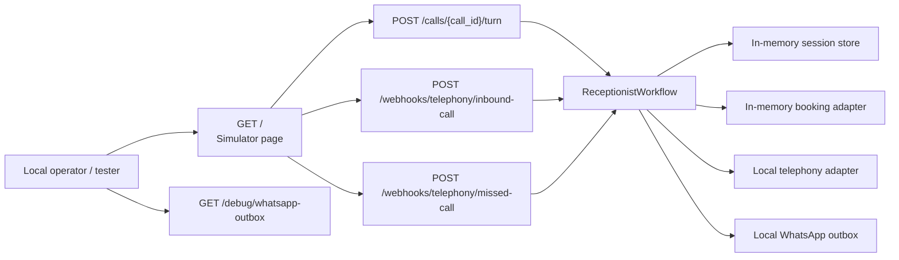

# What the Application Looks Like When Running

This repository currently runs as a small **FastAPI application** with two visible surfaces:

- a root-page **browser simulator** served directly by the backend
- an **HTTP API** for inbound calls, missed calls, and ongoing caller turns

There is no separate frontend application in this MVP. The only UI in the repository is the HTML page returned by `GET /`.

## Runtime Shape At A Glance

## User-Facing Screen

### Simulator Page

Opening the root URL shows a page titled **AI Voice Receptionist MVP**. Based on the HTML embedded in `app/api/routes.py`, the page is a lightweight test console for exercising the voice receptionist flows.

The page appears to include:

- a business selector with at least two demo businesses:
  - `demo-salon` / `Namma Glow Salon`
  - `demo-restaurant` / `Masala Table`
- fields for `call_id` and caller phone number
- buttons to start:
  - a normal inbound call
  - a missed-call recovery flow
- a text box for the caller utterance
- controls to send a caller turn and clear the session
- quick-test buttons for common prompts such as parking, services, landmark, transfer, and restaurant-specific menu or Jain-food questions
- a conversation panel showing the system reply and returned workflow actions
- a WhatsApp outbox panel showing messages sent to the owner

**Assumption:** this page is a developer/demo console, not a production end-user interface. The repository does not contain authentication, an operator dashboard, or a customer-facing web product beyond this embedded simulator.

## Likely User Journeys

### 1. Inbound Call Journey

1. A caller reaches the business.
2. The telephony layer posts an inbound-call event to `POST /webhooks/telephony/inbound-call`.
3. The workflow creates a call session and returns an opening greeting.
4. Subsequent caller utterances are sent to `POST /calls/{call_id}/turn`.
5. The workflow keeps replying until it answers an FAQ, completes a booking, or transfers the call.

### 2. Missed Call Recovery Journey

1. A missed-call event reaches `POST /webhooks/telephony/missed-call`.
2. The workflow queues a callback through the telephony adapter.
3. A call session is created for the callback attempt.
4. A WhatsApp summary is sent to the business owner.
5. The system returns a response indicating callback recovery has started.

### 3. Booking Journey

1. The caller says something that matches booking language such as `book`, `appointment`, `reservation`, `table`, `slot`, or `schedule`.
2. The workflow enters booking mode and tries to extract:
   - requested slot
   - caller name
   - optional party size
3. If the slot is missing, the system asks for date and time.
4. If the name is missing, the system asks for the name.
5. If the in-memory booking adapter reports the slot is available, the booking is created and the owner gets a WhatsApp confirmation.

### 4. FAQ Journey

The workflow can answer structured FAQ topics only. The implemented keys currently include:

- `timings`
- `parking`
- `pricing`
- `menu`
- `services`
- `staff_availability`
- `location`

If the caller asks a question outside those structured answers, the workflow falls back to a transfer path instead of attempting open-ended generation.

### 5. Human Transfer Journey

Transfer is triggered when the caller asks for a human, staff, manager, or owner, or when the FAQ path cannot answer the request. In that flow, the system:

- creates a transfer summary
- sends that summary to the owner through WhatsApp
- initiates a transfer via the telephony adapter
- tells the caller to hold

## Navigation Structure

The runnable application has a very shallow navigation model:

- `/` renders the simulator page
- `/health` is a health endpoint
- `/webhooks/telephony/inbound-call` accepts inbound call-start events
- `/webhooks/telephony/missed-call` accepts missed-call events
- `/calls/{call_id}/turn` advances an active conversation
- `/debug/whatsapp-outbox` exposes sent WhatsApp messages for inspection

There are no additional pages, menus, or route groups in the current MVP.

## Major Runtime Components

### HTTP Surface

The API is intentionally narrow. It models only the first interactions needed to simulate or receive call traffic:

- call start
- missed call recovery
- caller turn progression
- health/debug inspection

### Workflow Engine

`ReceptionistWorkflow` is the core runtime behavior. It is deterministic and rule-based rather than agentic. At runtime it decides between:

- booking
- FAQ answering
- human transfer
- clarification when intent is unclear

### Session State

Active call state is stored in memory. A session tracks:

- business profile
- caller number
- call source
- current stage
- inferred intent
- booking details
- transcript
- call summary

Because the session store is in-memory, active conversations are expected to disappear on process restart.

### Booking, Telephony, And WhatsApp Adapters

All three are local adapters in this MVP:

- telephony callback and transfer calls return local reference IDs
- WhatsApp messages are appended to an in-memory outbox
- bookings are stored in an in-memory map with generated booking references

This means the application behaves like a full workflow skeleton, but not yet like a production-integrated system.

## Integrations And External Touchpoints

The code and docs point to these intended integrations:

- telephony providers such as **Exotel** or **Plivo**
- WhatsApp Business messaging
- future STT/TTS providers
- future LLM providers
- future Redis for active session state
- future Postgres for durable business, booking, and call records

Those integrations are architectural placeholders at this stage. The running code currently uses only in-memory demo adapters.

## What A Consumer Actually Interacts With Today

Today, a consumer of this application would most likely be one of two things:

- a developer or operator opening `/` to simulate business calls locally
- an external telephony system posting events into the webhook endpoints

There is not yet a production customer UI, admin console, reporting interface, background-job dashboard, or real-time call-streaming interface in this repository.
