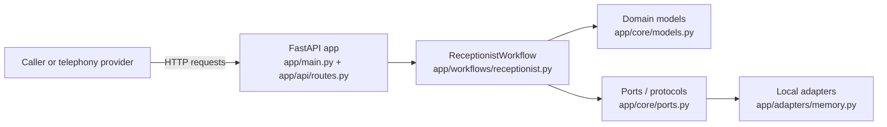
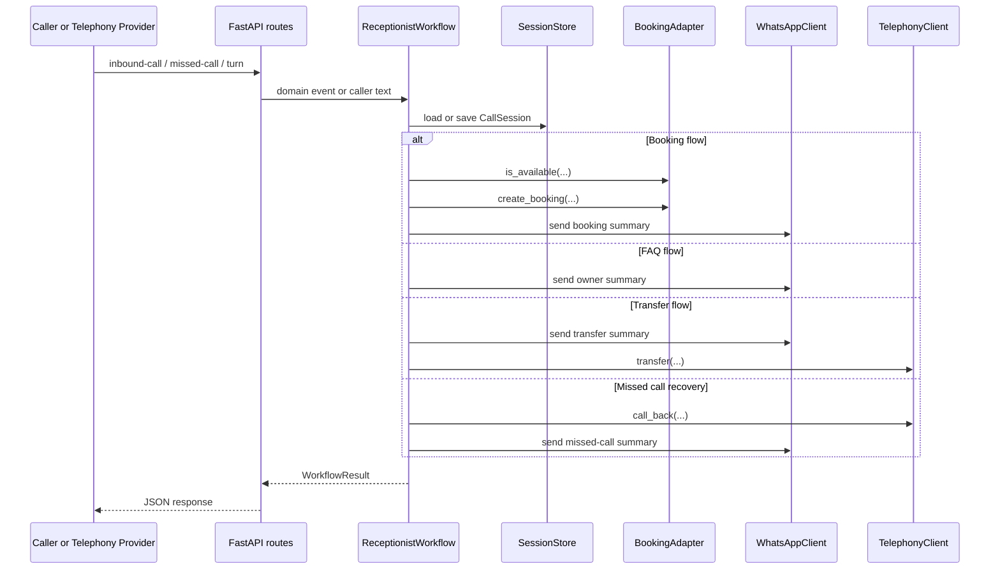

# High-Level Architecture

## System overview

The repository currently implements a lean backend MVP under `ai-voice-receptionist-mvp/`. It is a FastAPI service that exposes webhook-style endpoints and a small built-in simulator UI, then delegates all business behavior to a single orchestration module: `ReceptionistWorkflow`.

The architecture is intentionally simple and layered:

- `app/api/` handles HTTP requests and response serialization.
- `app/workflows/` contains the call-handling orchestration logic.
- `app/core/` defines domain models, port interfaces, and bootstrap wiring.
- `app/adapters/` provides local in-memory implementations of those ports.

This means the current codebase is best understood as a workflow engine with replaceable integration boundaries, not as a full production voice stack.

## Main components

### 1. HTTP application layer

- `app/main.py` creates the FastAPI app and mounts the shared router.
- `app/api/routes.py` exposes the runtime surface:
  - `GET /health`
  - `GET /` for the simulator page
  - `POST /webhooks/telephony/inbound-call`
  - `POST /webhooks/telephony/missed-call`
  - `POST /calls/{call_id}/turn`
  - `GET /debug/whatsapp-outbox`

This layer is thin. It converts request payloads into domain events and passes them into the workflow.

### 2. Workflow orchestration layer

- `app/workflows/receptionist.py` contains `ReceptionistWorkflow`, the core decision-maker in the system.

It handles three main entry paths:

- `handle_call_started(...)`
- `handle_missed_call(...)`
- `handle_caller_turn(...)`

Within those flows it performs:

- call session creation
- intent classification using keyword rules
- FAQ matching using keyword-to-FAQ mapping
- booking detail extraction using regex
- transfer initiation
- owner notification via WhatsApp

### 3. Domain and contract layer

- `app/core/models.py` defines the shared domain types:
  - `CallEvent`
  - `CallSession`
  - `BusinessProfile`
  - `BookingDetails`
  - `WorkflowResult`
  - `WhatsAppMessage`
  - enums such as `Intent`, `CallStage`, and `CallSource`
- `app/core/ports.py` defines the replaceable interfaces:
  - `BusinessRepository`
  - `SessionStore`
  - `TelephonyClient`
  - `WhatsAppClient`
  - `BookingAdapter`

These ports are the main architectural seam for future production integrations.

### 4. Bootstrap and adapter layer

- `app/core/bootstrap.py` assembles a demo container through `build_demo_container()`.
- `app/adapters/memory.py` implements the current adapter set:
  - `InMemoryBusinessRepository`
  - `InMemorySessionStore`
  - `InMemoryBookingAdapter`
  - `LocalTelephonyClient`
  - `LocalWhatsAppClient`

The repository ships with demo business profiles such as `demo-salon` and `demo-restaurant`, which provide FAQ content, transfer numbers, and default booking services.

## Major modules and responsibilities

| Module | Responsibility | Current implementation status |
| --- | --- | --- |
| `app/api` | HTTP ingress, request validation, simulator UI | Implemented |
| `app/workflows` | Call-state transitions and workflow decisions | Implemented |
| `app/core/models` | Shared business and session models | Implemented |
| `app/core/ports` | Contracts for external systems and persistence | Implemented |
| `app/core/bootstrap` | Dependency wiring for demo mode | Implemented |
| `app/adapters/memory` | Local stand-ins for providers and storage | Implemented |
| Real telephony provider integration | Provider-backed callback and transfer | Not implemented in repo |
| Real WhatsApp provider integration | Provider-backed outbound messages | Not implemented in repo |
| Durable data store | Persistent business, booking, and call records | Not implemented in repo |
| Real booking backend | External calendar/CRM or booking system | Not implemented in repo |

## Data flow

The main request path is from an inbound event or caller utterance to a workflow result and side effects.

## External dependencies

The implemented Python dependencies in `pyproject.toml` are minimal:

- `fastapi`
- `pydantic`
- `uvicorn[standard]`
- `pytest` and `httpx` for development/testing

At the code level, the system also depends on FastAPI response and routing primitives plus Pydantic request/response modeling.

## Third-party services

### Currently implemented

No live third-party services are integrated in the repository. The runtime uses local adapters only.

### Explicitly planned by the repository

The README and port structure point to these future service categories:

- Telephony provider such as Exotel or Plivo
- STT/TTS providers such as Deepgram, Google, Sarvam, or ElevenLabs
- LLM provider for faster structured routing
- WhatsApp provider for follow-up messaging

These are architectural intentions, not working integrations in the current code.

## Databases

### Current state

There is no real database in the implemented MVP.

- Active call state is stored in `InMemorySessionStore`.
- Business configuration is stored in `InMemoryBusinessRepository`.
- Bookings are stored in memory through `InMemoryBookingAdapter`.

All of this state is process-local and non-durable.

### Planned state

- **Assumption based on README and architecture notes:** Redis is intended for active call/session state.
- **Assumption based on README and architecture notes:** Postgres is intended for durable business records, bookings, and call history.

## Queues

No queueing system is implemented in the repository.

- There is no Kafka, RabbitMQ, SQS, Redis queue, or background event bus in the current code.
- Side effects such as booking creation, callback initiation, transfer initiation, and WhatsApp notifications happen synchronously inside workflow methods.

## Background jobs

No background job framework is implemented.

- There is no Celery, RQ, Dramatiq, cron-style scheduler, or worker process in the repository.
- Missed-call recovery is modeled as an immediate webhook-triggered action, not an asynchronously scheduled job.

## Architectural observations for maintainers

- The most important module is `ReceptionistWorkflow`; most product behavior is concentrated there.
- The code follows a ports-and-adapters style, which should make provider replacement straightforward if new adapters continue to honor `app/core/ports.py`.
- The current implementation is deterministic and rule-based. There is no autonomous agent loop, streaming voice pipeline, or durable event processing yet.
- The main productionization gap is infrastructure: real telephony, real messaging, durable persistence, and likely asynchronous handling for provider side effects.
