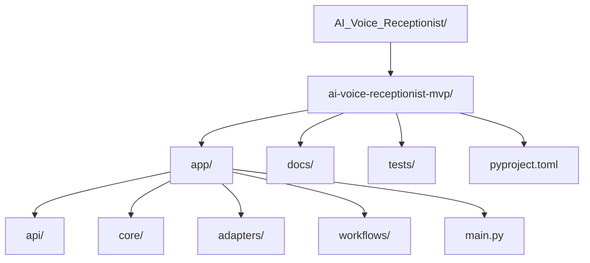

# 4. Repository Map

This repository is small and deliberately layered. The actual application code lives under `ai-voice-receptionist-mvp/`; the top-level repository is mostly a wrapper around that MVP package.

Assumption:
The source repository being documented is `snehashisc/AI_Voice_Receptionist` on GitHub. This workspace contains generated docs, not the application checkout itself, so the map below is based on the upstream repository structure that is visible from the repository contents and source files.

## Structure At A Glance

## Read These First

New engineers should start in this order:

1. `ai-voice-receptionist-mvp/README.md`
2. `ai-voice-receptionist-mvp/app/workflows/receptionist.py`
3. `ai-voice-receptionist-mvp/app/core/models.py`
4. `ai-voice-receptionist-mvp/app/core/ports.py`
5. `ai-voice-receptionist-mvp/app/api/routes.py`
6. `ai-voice-receptionist-mvp/tests/test_receptionist_workflow.py`

That sequence gives the fastest path from business behavior to code structure: what the app does, how calls are routed, which domain objects exist, which integrations are abstracted, which HTTP endpoints exist, and how the intended behavior is validated.

## Major Folders

### `ai-voice-receptionist-mvp/`

- Purpose: The real application root.
- Responsibility: Holds runtime code, tests, packaging metadata, and upstream project docs.
- Important files: `README.md`, `pyproject.toml`.
- Why it exists: The top-level repository currently wraps a single MVP package rather than spreading code across multiple apps or services.

### `ai-voice-receptionist-mvp/app/`

- Purpose: Python application package.
- Responsibility: Contains the FastAPI entry point plus the business workflow, domain contracts, and local adapters.
- Important files: `main.py`, `api/routes.py`, `core/models.py`, `core/ports.py`, `core/bootstrap.py`, `adapters/memory.py`, `workflows/receptionist.py`.
- Why it exists: This is the implementation boundary for the MVP. It keeps transport, domain, orchestration, and adapter code in one package.

### `ai-voice-receptionist-mvp/app/api/`

- Purpose: HTTP surface area.
- Responsibility: Exposes health checks, telephony webhook endpoints, caller turn handling, a debug WhatsApp outbox endpoint, and a built-in simulator HTML page.
- Important files: `routes.py`.
- Why it exists: It isolates web concerns from the receptionist workflow so the workflow can stay transport-agnostic.

### `ai-voice-receptionist-mvp/app/core/`

- Purpose: Domain and application contracts.
- Responsibility: Defines the main models, provider interfaces, and bootstrap wiring for demo mode.
- Important files: `models.py`, `ports.py`, `bootstrap.py`.
- Why it exists: This is the architectural center of the codebase. It separates stable business concepts from implementation details.

### `ai-voice-receptionist-mvp/app/adapters/`

- Purpose: Local implementations of external dependencies.
- Responsibility: Provides in-memory or local adapters for business lookup, call session storage, telephony, WhatsApp, and booking creation.
- Important files: `memory.py`.
- Why it exists: The MVP intentionally validates workflows before real providers are integrated. These adapters make the app runnable and testable without external systems.

### `ai-voice-receptionist-mvp/app/workflows/`

- Purpose: Call-handling orchestration.
- Responsibility: Implements the deterministic receptionist logic for inbound calls, missed-call recovery, booking collection, FAQ handling, and human transfer.
- Important files: `receptionist.py`.
- Why it exists: This is where the product behavior lives. A new engineer will spend most maintenance time here when changing conversation flows.

### `ai-voice-receptionist-mvp/docs/`

- Purpose: Upstream design and architecture notes.
- Responsibility: Holds supporting project documentation for the MVP.
- Important files: Directory presence is verified, but exact filenames were not fully re-verified during this run because GitHub directory reads hit a rate limit after initial repository inspection.
- Why it exists: It gives architectural and scope context outside the executable code.

### `ai-voice-receptionist-mvp/tests/`

- Purpose: Behavioral regression coverage.
- Responsibility: Verifies both the workflow rules and the API surface.
- Important files: `test_receptionist_workflow.py`, `test_api_routes.py`.
- Why it exists: The repo relies on deterministic flow logic, so tests act as the clearest executable specification of expected receptionist behavior.

## Path Table

| Path | Purpose | Importance |
| ---- | ------- | ---------- |
| `ai-voice-receptionist-mvp/` | Real application root containing code, docs, tests, and packaging metadata | Critical |
| `ai-voice-receptionist-mvp/README.md` | Fastest orientation to MVP goals, stack direction, and local run flow | Critical |
| `ai-voice-receptionist-mvp/pyproject.toml` | Python package metadata, runtime dependencies, and test configuration | High |
| `ai-voice-receptionist-mvp/app/` | Main application package | Critical |
| `ai-voice-receptionist-mvp/app/main.py` | FastAPI startup entry point that creates the app and mounts routes | High |
| `ai-voice-receptionist-mvp/app/api/` | HTTP and webhook layer | High |
| `ai-voice-receptionist-mvp/app/api/routes.py` | All current endpoints plus the embedded simulator UI | Critical |
| `ai-voice-receptionist-mvp/app/core/` | Domain models, contracts, and bootstrap wiring | Critical |
| `ai-voice-receptionist-mvp/app/core/models.py` | Main business objects like `CallSession`, `BusinessProfile`, and `WorkflowResult` | Critical |
| `ai-voice-receptionist-mvp/app/core/ports.py` | Integration interfaces for telephony, WhatsApp, booking, session state, and business lookup | Critical |
| `ai-voice-receptionist-mvp/app/core/bootstrap.py` | Demo-mode dependency wiring that assembles the running container | High |
| `ai-voice-receptionist-mvp/app/adapters/` | Local and in-memory integration implementations | High |
| `ai-voice-receptionist-mvp/app/adapters/memory.py` | Demo data plus fake adapters for telephony, WhatsApp, bookings, and session persistence | High |
| `ai-voice-receptionist-mvp/app/workflows/` | Deterministic call orchestration logic | Critical |
| `ai-voice-receptionist-mvp/app/workflows/receptionist.py` | Core business behavior for booking, FAQ, transfer, and missed-call recovery | Critical |
| `ai-voice-receptionist-mvp/docs/` | Supporting upstream documentation | Medium |
| `ai-voice-receptionist-mvp/tests/` | Automated checks for API and workflow behavior | High |
| `ai-voice-receptionist-mvp/tests/test_receptionist_workflow.py` | Primary behavior spec for receptionist flow decisions | Critical |
| `ai-voice-receptionist-mvp/tests/test_api_routes.py` | Coverage for the HTTP-facing contract | High |

## What This Means For Onboarding

The repository is easy to navigate once you understand one rule: `app/workflows/receptionist.py` is the behavioral center, and everything else either feeds it, abstracts dependencies around it, or verifies it.

If a new engineer needs to change business behavior, start with:

1. `app/workflows/receptionist.py`
2. `app/core/models.py`
3. `app/core/ports.py`
4. `tests/test_receptionist_workflow.py`

If the change is about HTTP/webhooks or simulator behavior, start with:

1. `app/api/routes.py`
2. `app/main.py`
3. `app/core/bootstrap.py`

If the change is about replacing demo components with real providers, start with:

1. `app/core/ports.py`
2. `app/adapters/memory.py`
3. `app/core/bootstrap.py`
