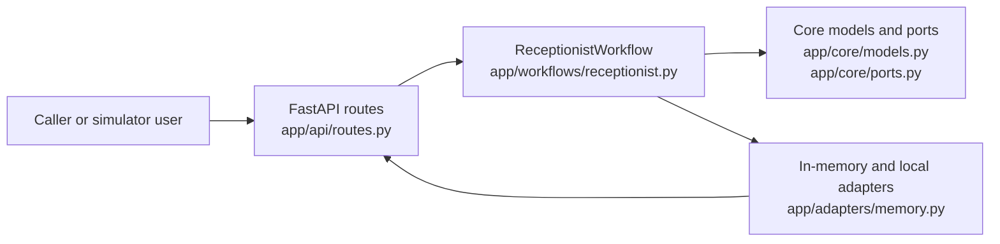
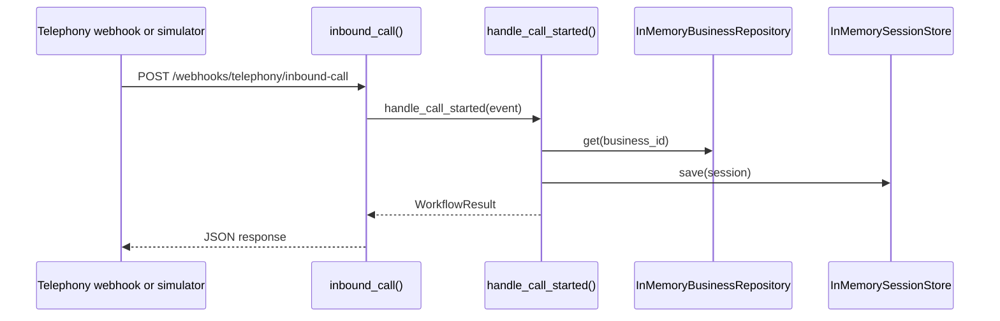
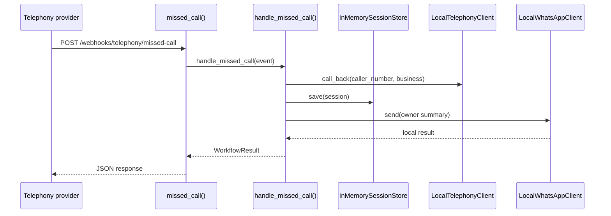

# 5. Request Lifecycle

This MVP is API-first. There is no separate frontend application in the repository snapshot I could verify. The user-facing interaction is exposed through HTTP endpoints in `ai-voice-receptionist-mvp/app/api/routes.py`, plus a small simulator page served by `app_home()`.

One important onboarding detail: the current request lifecycle stops at in-memory adapters, not a database. The README explicitly says Postgres, Redis, telephony providers, and WhatsApp providers are planned later, while this MVP uses local adapters now.

## Lifecycle Map

## Journey 1: Inbound Call Starts a New Session

Representative action: the telephony provider, or the local simulator, posts an inbound-call event.

### Request path

1. `POST /webhooks/telephony/inbound-call` hits `inbound_call()` in `ai-voice-receptionist-mvp/app/api/routes.py`.
2. `inbound_call()` builds a `CallEvent` with `source=CallSource.INBOUND`.
3. The route calls `container.workflow.handle_call_started(event)`.
4. `ReceptionistWorkflow.handle_call_started()` in `ai-voice-receptionist-mvp/app/workflows/receptionist.py`:
   - loads the business with `self.businesses.get(event.business_id)`
   - creates a `CallSession`
   - writes the session with `self.sessions.save(session)`
   - builds the spoken greeting string
5. The route returns `WorkflowResult.model_dump(mode="json")`.

### Storage and side effects

- Session persistence is currently handled by `InMemorySessionStore` in `ai-voice-receptionist-mvp/app/adapters/memory.py`, not a database.
- Business lookup is handled by `InMemoryBusinessRepository`.
- No external telephony call is placed in this path; the endpoint prepares state and returns the greeting payload.

### Sequence

## Journey 2: Caller Books an Appointment During an Active Call

Representative action: a caller says something like the README example, `Can I book a haircut tomorrow at 5 pm? My name is Sneha.`

### Request path

1. `POST /calls/{call_id}/turn` hits `call_turn()` in `ai-voice-receptionist-mvp/app/api/routes.py`.
2. The route calls `container.workflow.handle_caller_turn(call_id, payload.text)`.
3. `ReceptionistWorkflow.handle_caller_turn()` in `ai-voice-receptionist-mvp/app/workflows/receptionist.py`:
   - loads the active session with `self.sessions.get(call_id)`
   - appends the utterance to `session.transcript`
   - classifies the utterance with `_classify_intent()`
   - optionally maps FAQ terms with `_faq_key()`
   - dispatches to `_handle_booking()`, `_handle_faq()`, or `_handle_transfer()`
4. In the booking branch, `_handle_booking()`:
   - sets `session.intent = Intent.BOOKING`
   - extracts fields with `_merge_booking()`
   - checks availability with `self.booking.is_available(...)`
   - creates the booking with `self.booking.create_booking(session)`
   - saves the updated session
   - notifies the owner with `_notify_owner(...)`
5. `call_turn()` returns `result.model_dump(mode="json")`.

### Files and functions involved

- Route entry: `ai-voice-receptionist-mvp/app/api/routes.py`
  - `call_turn()`
- Workflow orchestration: `ai-voice-receptionist-mvp/app/workflows/receptionist.py`
  - `handle_caller_turn()`
  - `_handle_booking()`
  - `_merge_booking()`
  - `_notify_owner()`
- Core contracts: `ai-voice-receptionist-mvp/app/core/ports.py`
  - `BookingAdapter`, `BusinessRepository`, `SessionStore`, `TelephonyClient`, `WhatsAppClient`
- Current concrete implementations: `ai-voice-receptionist-mvp/app/adapters/memory.py`
  - `InMemoryBookingAdapter`
  - `InMemorySessionStore`
  - `LocalWhatsAppClient`

### Why this matters

This is the main “business transaction” path in the MVP. It is where user text becomes structured intent, then a booking side effect, then a response payload.

## Journey 3: Missed Call Recovery Triggers Follow-up

Representative action: the telephony system reports a missed call.

### Request path

1. `POST /webhooks/telephony/missed-call` hits `missed_call()` in `ai-voice-receptionist-mvp/app/api/routes.py`.
2. `missed_call()` builds a `CallEvent` with `source=CallSource.MISSED_CALLBACK`.
3. The route calls `container.workflow.handle_missed_call(event)`.
4. `ReceptionistWorkflow.handle_missed_call()` in `ai-voice-receptionist-mvp/app/workflows/receptionist.py`:
   - loads the business with `self.businesses.get(event.business_id)`
   - triggers a callback with `self.telephony.call_back(event.caller_number, business)`
   - creates and saves a `CallSession`
   - sends an owner message through `_notify_owner(...)`
5. The route returns `WorkflowResult.model_dump(mode="json")`.

### Storage and side effects

- Session state is written through `InMemorySessionStore`.
- The callback side effect uses `LocalTelephonyClient.call_back(...)`.
- Owner notification uses `LocalWhatsAppClient.send(...)`.

### Sequence

## Journey 4: Caller Requests Human Transfer

Representative action: during an active call, the caller asks to speak to a person.

### Request path

1. `POST /calls/{call_id}/turn` again enters through `call_turn()`.
2. `ReceptionistWorkflow.handle_caller_turn()` classifies the utterance as a transfer request.
3. `_handle_transfer()` sets `session.stage = CallStage.TRANSFERRED`, sends an owner summary, and calls `self.telephony.transfer(session, session.business.transfer_number, session.summary)`.
4. `LocalTelephonyClient.transfer(...)` records the transfer locally and returns a reference such as `local-transfer-1`.
5. The route sends the final `WorkflowResult` JSON back to the caller-facing channel.

### Implementation note

This is not a separate endpoint. Transfer is one branch inside the turn-processing workflow, which means changes to intent routing can affect booking, FAQ, and transfer behavior together.

## What A New Engineer Should Read First

1. `ai-voice-receptionist-mvp/app/api/routes.py`
   This is the HTTP boundary and the fastest way to see supported request types.
2. `ai-voice-receptionist-mvp/app/workflows/receptionist.py`
   This is the orchestration layer where nearly all request branching happens.
3. `ai-voice-receptionist-mvp/app/core/ports.py` and `ai-voice-receptionist-mvp/app/adapters/memory.py`
   These show which side effects are abstracted and which ones are still local in-memory implementations.
4. `ai-voice-receptionist-mvp/README.md`
   This contains the concrete curl examples for the three most important lifecycle entrypoints.

## Current Boundary of the Lifecycle

The request lifecycle in this repository currently ends with local adapters and returned JSON, not with durable infrastructure:

- No verified database write path was found in the current snapshot.
- No verified queue or background job path was found in the current snapshot.
- Planned production dependencies are documented in `ai-voice-receptionist-mvp/README.md`, but they are not the active runtime path today.
