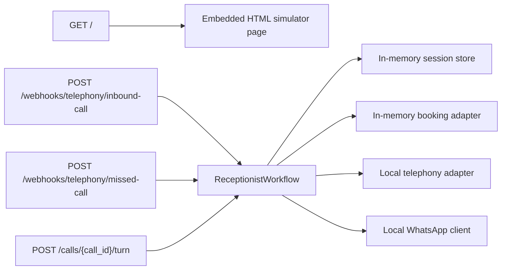

# Entry Points

This repository currently starts as a small **FastAPI backend**. There is no separate frontend boot process, worker process, or background scheduler in the code that was inspected. The runtime begins with Uvicorn loading `app.main:app`, which in turn imports the API router and registers all HTTP routes.

## Main Application Entry Point

The main runtime entry point is:

- `ai-voice-receptionist-mvp/app/main.py`

The local run command documented in the repository is:

```bash
uvicorn app.main:app --reload
```

That means Uvicorn imports the `app.main` module, looks for the module-level `app` object, and serves it as the ASGI application.

## Startup Sequence At A Glance

```mermaid
flowchart TD
    A["Developer runs `uvicorn app.main:app --reload`"] --> B["Uvicorn imports `app.main`"]
    B --> C["`app.main` imports `router` from `app.api.routes`"]
    C --> D["`app.api.routes` creates `router = APIRouter()`"]
    D --> E["`app.api.routes` calls `build_demo_container()` at import time"]
    E --> F["`app.core.bootstrap` wires in-memory adapters and `ReceptionistWorkflow`"]
    F --> G["Control returns to `app.main`"]
    G --> H["`FastAPI(...)` instance is created"]
    H --> I["`app.include_router(router)` registers endpoints"]
    I --> J["Application begins serving HTTP requests"]
```

## What Happens First When The Application Starts?

The first meaningful application work happens during **module import**, not during the first request.

Step by step:

1. Uvicorn starts and imports `app.main`.
2. `app.main` imports `router` from `app.api.routes`.
3. While `app.api.routes` is being imported, it immediately constructs:
   - `router = APIRouter()`
   - `container = build_demo_container()`
4. `build_demo_container()` in `app/core/bootstrap.py` creates the runtime dependencies:
   - `InMemoryBusinessRepository.demo()`
   - `InMemorySessionStore()`
   - `LocalTelephonyClient()`
   - `LocalWhatsAppClient()`
   - `InMemoryBookingAdapter()`
5. Those dependencies are injected into `ReceptionistWorkflow(...)`.
6. Import continues in `app.api.routes`, where route handlers are defined against the already-created router and container.
7. Control returns to `app.main`, which creates the `FastAPI(...)` application object.
8. `app.include_router(router)` attaches all routes to the application.
9. Uvicorn begins serving requests.

## Dependency Initialization

Dependency wiring is centralized in:

- `ai-voice-receptionist-mvp/app/core/bootstrap.py`

This file acts as the current composition root for the MVP. It builds a `Container` dataclass with:

- `workflow: ReceptionistWorkflow`
- `whatsapp: LocalWhatsAppClient`

The workflow receives these dependencies through constructor injection:

- `BusinessRepository`
- `SessionStore`
- `TelephonyClient`
- `WhatsAppClient`
- `BookingAdapter`

The interface contracts for those dependencies live in:

- `ai-voice-receptionist-mvp/app/core/ports.py`

The concrete implementations currently used at startup are all local or in-memory:

- `InMemoryBusinessRepository`
- `InMemorySessionStore`
- `LocalTelephonyClient`
- `LocalWhatsAppClient`
- `InMemoryBookingAdapter`

This is important for onboarding: the app is structured as if it will later swap in Redis, Postgres, telephony providers, and WhatsApp providers, but the present startup path always builds the in-memory demo stack.

## Configuration Loading

There is currently **very little runtime configuration logic** in the inspected code.

What is present:

- package metadata and dependency declarations in `ai-voice-receptionist-mvp/pyproject.toml`
- a documented run command in `ai-voice-receptionist-mvp/README.md`
- hard-coded application metadata in `app/main.py`
- hard-coded demo businesses and FAQ data in `app/adapters/memory.py`

What is not present in the inspected startup path:

- no `.env` loader
- no Pydantic settings object
- no environment-specific config module
- no startup hook that reads secrets or provider credentials
- no database connection setup

Assumption:

- The MVP is intentionally configured as a self-contained demo so it can run locally without external infrastructure.

## Routing Setup

Routing is defined in:

- `ai-voice-receptionist-mvp/app/api/routes.py`

`app.main` does not build routes itself. It imports a prebuilt `router` and registers it with `app.include_router(router)`.

The current route surface is flat:

- `GET /health`
- `GET /`
- `POST /webhooks/telephony/inbound-call`
- `POST /webhooks/telephony/missed-call`
- `POST /calls/{call_id}/turn`
- `GET /debug/whatsapp-outbox`

There are no nested route modules, versioned API prefixes, or separate admin/public routers in the current code.

## Request Entry Points

Once startup is complete, requests enter through one of two primary paths:



Two details matter here:

- `GET /` is not a separate frontend app. It returns a large HTML string embedded directly inside `routes.py`.
- The workflow container is shared at module scope, so request handlers reuse the same in-memory adapters for the lifetime of the process.

## Step-By-Step Startup Walkthrough

### 1. Process boot

The operator starts the service with Uvicorn. At this point, Python dependency resolution and ASGI boot are handled by Uvicorn and FastAPI.

### 2. Module import

Python imports `app.main`, which immediately imports `app.api.routes`. Because `routes.py` creates `container = build_demo_container()` at the top level, dependency construction happens before the first request arrives.

### 3. Demo data and adapters are created

`build_demo_container()` creates:

- demo business profiles
- an empty in-memory session store
- an empty in-memory booking adapter
- local telephony and WhatsApp adapters
- the `ReceptionistWorkflow` that coordinates them

### 4. FastAPI app object is created

`app = FastAPI(...)` is instantiated in `app.main` with the title, version, and description for the MVP.

### 5. Routes are attached

`app.include_router(router)` makes the handlers from `routes.py` live. At this point, the service knows how to answer health checks, render the simulator UI, accept telephony webhook events, and continue conversations.

### 6. Requests begin

After import and route registration complete, the application starts handling HTTP traffic. The most important first request types are:

- `GET /` for the local simulator UI
- `POST /webhooks/telephony/inbound-call` for a new inbound call
- `POST /webhooks/telephony/missed-call` for missed-call recovery

## Onboarding Notes

- The practical composition root is `app/core/bootstrap.py`, even though the ASGI entry point is `app/main.py`.
- Startup side effects happen inside `app/api/routes.py` because the container is built at import time.
- The app has no explicit FastAPI lifespan handlers yet, so there is no formal startup/shutdown orchestration layer.
- If the project later adds Redis, Postgres, or real providers, `build_demo_container()` is the first place to inspect for startup changes.
