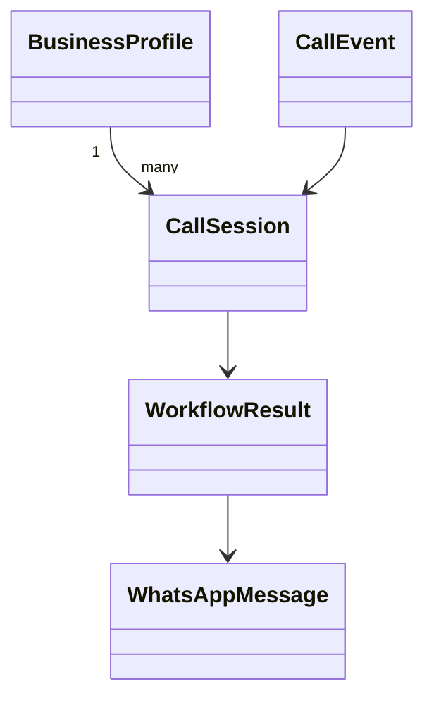

# Core Domain Concepts

The codebase centers on a small set of business objects that model a call, the business being served, and the actions the receptionist can take during a conversation. The design is intentionally narrow: the domain is meant to support a deterministic workflow rather than a broad platform model.

## Main domain entities

### `BusinessProfile`

Purpose: stores the configuration for one business.

Relationships:
- owns the business name and contact details
- provides the transfer number
- holds structured FAQ content
- supplies the default booking service or similar business-specific context

Where implemented:
- `ai-voice-receptionist-mvp/app/core/models.py`
- demo data in `ai-voice-receptionist-mvp/app/adapters/memory.py`

### `CallSession`

Purpose: represents one active call and the mutable state attached to it.

Relationships:
- belongs to one `BusinessProfile`
- tracks the caller number, current stage, inferred intent, transcript, and booking details
- is loaded and saved through `SessionStore`

Where implemented:
- `ai-voice-receptionist-mvp/app/core/models.py`
- `ai-voice-receptionist-mvp/app/core/ports.py`

### `WorkflowResult`

Purpose: captures what the workflow wants the API or caller to do next.

Relationships:
- produced by `ReceptionistWorkflow`
- includes the next message to say, the actions performed, and a summary for side effects

Where implemented:
- `ai-voice-receptionist-mvp/app/core/models.py`

## Supporting value objects and resources

### `CallEvent`

Purpose: describes inbound telephony events such as call start or missed call.

Relationships:
- received by the HTTP layer
- transformed into workflow input

Where implemented:
- `ai-voice-receptionist-mvp/app/core/models.py`

### `WhatsAppMessage`

Purpose: represents an owner-facing notification message.

Relationships:
- created by the workflow
- sent through `WhatsAppClient`

Where implemented:
- `ai-voice-receptionist-mvp/app/core/models.py`

### `BookingRequest` / booking data

Purpose: captures the slot, caller name, and related booking details needed to reserve a time.

Relationships:
- assembled by the workflow from caller text
- validated by the booking adapter before confirmation

Where implemented:
- `ai-voice-receptionist-mvp/app/core/models.py`
- booking behavior in `ai-voice-receptionist-mvp/app/workflows/receptionist.py`

## Aggregates

The practical aggregate in this MVP is the call session:

- `CallSession` is the center of state for a conversation.
- The workflow mutates it as the call progresses.
- Side effects such as booking creation, WhatsApp notifications, and transfer requests are driven from that state.

That makes the call session the main consistency boundary in the current design.

## Business language

The domain vocabulary is consistent across the docs and code:

- **business profile**: one customer/business configuration
- **caller**: the person on the phone
- **transfer**: hand off to a human
- **booking**: a reservation or appointment
- **FAQ**: a structured, business-provided answer set
- **summary**: a short owner-facing recap sent over WhatsApp

## Relationship sketch

## Scope note

- **Assumption:** the project may gain more domain entities later, but the current repository only needs the small set above to support the MVP workflows.
