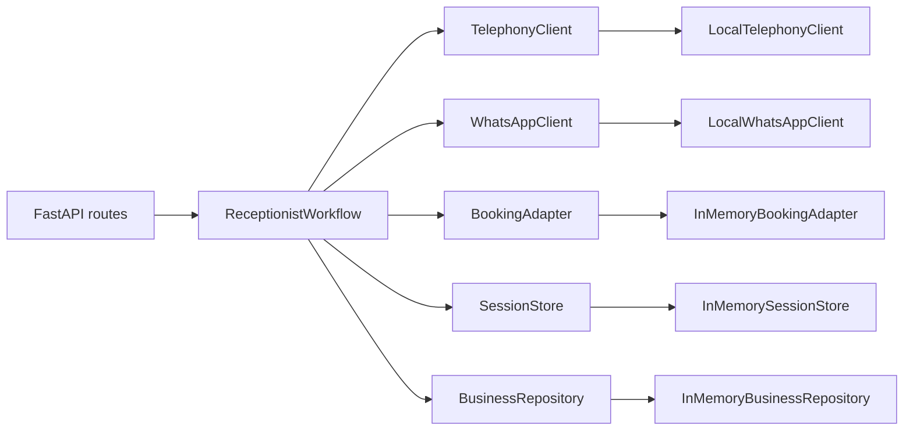

# Design Patterns and Architecture Patterns

The repository uses a deliberately simple architectural style. The patterns are present to keep the workflow deterministic and the integration surfaces replaceable.

## Ports and adapters

Where it exists:
- `ai-voice-receptionist-mvp/app/core/ports.py`
- `ai-voice-receptionist-mvp/app/adapters/memory.py`
- `ai-voice-receptionist-mvp/app/core/bootstrap.py`
- `ai-voice-receptionist-mvp/app/workflows/receptionist.py`

Why it was used:
- to keep telephony, WhatsApp, booking, session state, and business lookup swappable
- to let the MVP run with local adapters now and real providers later

What it looks like:
- the workflow depends on protocols
- the bootstrap layer wires concrete implementations
- adapters provide in-memory demo behavior

## Service layer / orchestration layer

Where it exists:
- `ai-voice-receptionist-mvp/app/workflows/receptionist.py`

Why it was used:
- to centralize call decision-making in one place
- to keep HTTP routes thin
- to make booking, FAQ, transfer, and missed-call behavior deterministic

## Dependency injection

Where it exists:
- `ai-voice-receptionist-mvp/app/core/bootstrap.py`
- route handlers in `ai-voice-receptionist-mvp/app/api/routes.py`

Why it was used:
- to build the workflow from components rather than hard-coding dependencies inside handlers
- to make the demo container easy to swap when real providers arrive

## Repository-like boundary for state

Where it exists:
- `SessionStore` in `ai-voice-receptionist-mvp/app/core/ports.py`
- `InMemorySessionStore` in `ai-voice-receptionist-mvp/app/adapters/memory.py`

Why it was used:
- to isolate call state persistence behind a clean contract
- to prepare for Redis or other storage later

## Adapter pattern for external systems

Where it exists:
- `TelephonyClient`
- `WhatsAppClient`
- `BookingAdapter`

Why it was used:
- external providers can be swapped without rewriting workflow logic
- the local implementation can simulate integrations during development and testing

## Deterministic workflow pattern

Where it exists:
- `ReceptionistWorkflow`

Why it was used:
- the MVP needs predictable behavior more than open-ended generation
- keywords, FAQ lookup, and regex extraction are easier to test and explain than a fully agentic design

## Patterns not yet present

The repository does not currently implement:

- CQRS
- event-driven messaging
- hexagonal architecture as a full platform
- background job orchestration
- distributed queue processing

Those may become relevant later, but they are not in the active runtime today.

## Pattern sketch

