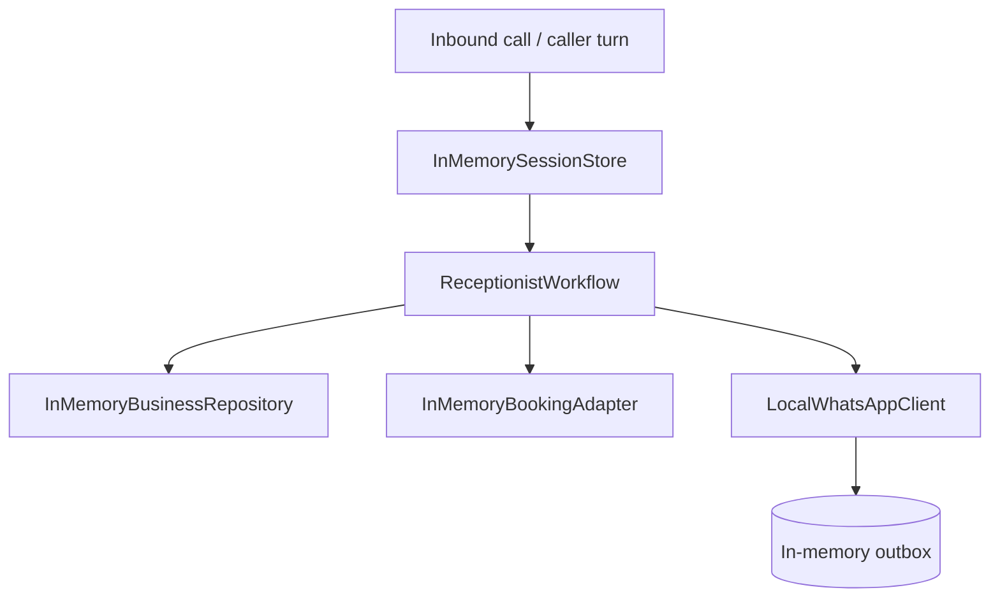

# Database Understanding

The current MVP does not use a real database. Instead, the repository uses in-memory stores so the workflow can run locally without external infrastructure.

## What is stored today

### Business profiles

Stored in:
- `InMemoryBusinessRepository`

Contains:
- business name
- transfer number
- FAQ content
- default booking or service context

### Active call sessions

Stored in:
- `InMemorySessionStore`

Contains:
- call ID
- business ID
- caller number
- current stage
- transcript
- booking state
- summary data

### Bookings

Stored in:
- `InMemoryBookingAdapter`

Contains:
- slot information
- caller name
- booking reference
- availability state

### WhatsApp outbox

Stored in:
- `LocalWhatsAppClient`

Contains:
- owner-facing messages that would be sent by a real provider

## Data lifecycle

1. The app starts with demo business profiles and local adapters.
2. A call event creates or loads a `CallSession`.
3. The workflow mutates the session as the caller speaks.
4. Bookings or notifications are written to in-memory stores.
5. The response is returned immediately to the HTTP caller.

Because storage is in memory:

- data is lost on restart
- there is no migration layer
- there are no persistent tables yet

## Future persistent storage

The repo’s docs point to the likely next storage layer:

- **Redis** for active session state with TTL
- **Postgres** for business profiles, bookings, and call records

That future state is not implemented in the current codebase, so there are no actual SQL tables to document yet.

## Diagram

## Scope note

- **Assumption:** the first durable database will likely be Postgres, because the roadmap and architecture docs point to it for business records, bookings, and call history.
