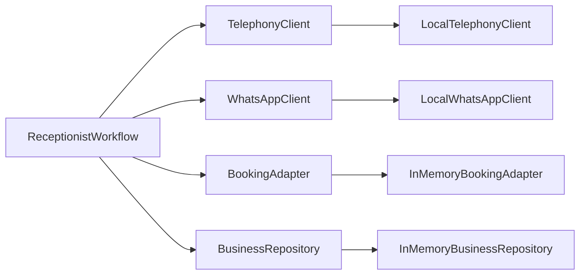

# Integrations and Adapters

The repository currently uses local adapters to simulate the external systems that will be integrated later. The active code path is intentionally provider-neutral.

## Adapter and Integration Guide

### Telephony

Why it exists:
- receives inbound call webhooks
- triggers missed-call callbacks
- initiates transfers to a human

Implemented by:
- `TelephonyClient` in `ai-voice-receptionist-mvp/app/core/ports.py`
- `LocalTelephonyClient` in `ai-voice-receptionist-mvp/app/adapters/memory.py`
- route handlers in `ai-voice-receptionist-mvp/app/api/routes.py`

Flow through the system:
- telephony provider posts to FastAPI webhook endpoints
- the workflow decides whether to callback, transfer, or continue the conversation
- the adapter returns a simulated reference ID today

### WhatsApp

Why it exists:
- sends owner-facing summaries for missed calls, bookings, transfers, and FAQ outcomes

Implemented by:
- `WhatsAppClient` in `ai-voice-receptionist-mvp/app/core/ports.py`
- `LocalWhatsAppClient` in `ai-voice-receptionist-mvp/app/adapters/memory.py`

Flow through the system:
- workflow generates a concise summary
- the WhatsApp client stores or emits the message
- the debug endpoint exposes the outbox in demo mode

### Booking / calendar

Why it exists:
- validates availability for appointments or table bookings
- creates a booking record when the slot is available

Implemented by:
- `BookingAdapter` in `ai-voice-receptionist-mvp/app/core/ports.py`
- `InMemoryBookingAdapter` in `ai-voice-receptionist-mvp/app/adapters/memory.py`

Flow through the system:
- caller intent is recognized as booking intent
- the workflow extracts time/name details
- the booking adapter checks availability and stores the booking

### Business repository

Why it exists:
- provides the business profile and FAQ content for a given business ID

Implemented by:
- `BusinessRepository` in `ai-voice-receptionist-mvp/app/core/ports.py`
- `InMemoryBusinessRepository` in `ai-voice-receptionist-mvp/app/adapters/memory.py`

Flow through the system:
- request arrives with a business ID
- the workflow loads the business profile
- the profile drives FAQ answers, transfer numbers, and booking defaults

## External integrations planned, not live

The docs and roadmap point to these future integrations:

- Exotel or Plivo for telephony
- WhatsApp Business provider
- Redis for session storage
- Postgres for durable records
- future STT/TTS/LLM providers for audio and language support

Those are integration targets, not active dependencies in the current runtime.

## Integration sketch

## Scope note

- **Assumption:** the first production telephony integration will be Exotel or Plivo, because those are the providers explicitly named in the roadmap and tech-stack docs.
