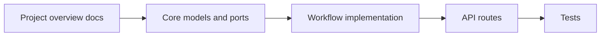

# Reading Order for New Engineers

This is the shortest path to understanding the codebase without reading everything.

## Day 1

1. Read [`docs/project-overview.md`](../project-overview.md).
2. Read [`docs/repository-summary.md`](../repository-summary.md).
3. Read [`docs/api-flow.md`](../api-flow.md).
4. Read [`docs/architecture.md`](../architecture.md).
5. Skim `docs/generated-onboarding/01-executive-summary.md` and `02-application-overview.md`.

Why:
- these files explain the product goal, the runtime shape, and the main workflows before you touch code

## Day 2

1. Read `ai-voice-receptionist-mvp/app/core/models.py`.
2. Read `ai-voice-receptionist-mvp/app/core/ports.py`.
3. Read `ai-voice-receptionist-mvp/app/core/bootstrap.py`.
4. Read `ai-voice-receptionist-mvp/app/adapters/memory.py`.
5. Read `ai-voice-receptionist-mvp/app/workflows/receptionist.py`.

Why:
- these files show the domain types, integration contracts, local adapters, and the actual workflow decisions

## Day 3

1. Read `ai-voice-receptionist-mvp/app/api/routes.py`.
2. Read the tests under `ai-voice-receptionist-mvp/tests/`.
3. Revisit `docs/api-flow.md` and trace each sequence against the code.

Why:
- this shows how HTTP requests enter the system and how the workflow is validated

## What to focus on first

- `ReceptionistWorkflow` is the behavioral center.
- `core/ports.py` is the boundary between business logic and integrations.
- `adapters/memory.py` shows the current runtime dependencies.
- `api/routes.py` shows how the workflow is exposed over HTTP.

## Suggested first debugging loop

1. Start the app locally.
2. Open the simulator page at `/`.
3. Trigger an inbound call.
4. Step through a booking or FAQ path.
5. Inspect the WhatsApp outbox.

That loop covers most of the meaningful runtime behavior in the MVP.

## Learning path map

## Scope note

- **Assumption:** the repository will continue to stay workflow-first, so the best onboarding sequence is still to start from the orchestration layer and work outward.
